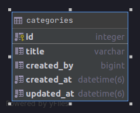

# W08-D03

# Recipes API Part 1

## Part1 - create a new app
In this homework series, we are going to build fully-functional recipes API. We can create our rails app using the following command.

```rails new recipes-api --api -skip-active-storage```

## Part2 - create a model

Let's go ahead and create a new model, name this model as `Category`. We can use the following command to generate the model `rails g model Category`.

This model should be consist of the following `fields`.

```text
t.string :title
t.bigint :created_by
```

Once you're done adding the fields, you can create the migration file using the following command `rails d migration 'created_the_category_table` and finally create the table using `rails db:migrate`.

Your final models should look like this.




## Part3 - adding a controller
Now that our model is all set up, let's generate the controller.

```
rails g controller Categories
```
File path ```app/controllers/categories_controller.rb```

Now go ahead and create all the rest controller methods here. The RESTful API must consist of the endpoints. 

|Prefix| Verb|URI Pattern| Controller#Action |
|--|--|--|--|
|categories|GET| /categories(.:format)| categories#index|
||POST|/categories(.:format)|categories#create|
|category|GET|/categories/:id(.:format)|categories#show|
||PATCH|/categories/:id(.:format)|categories#update|
||PUT|/categories/:id(.:format)|categories#update|
||DELETE|/categories/:id(.:format)|categories#destroy|

## Part4 - set the routes
Configure the routes ```recipes-api/config/routes.rb```

## Part5 - Test your RESTful API using POSTMAN

## How to submit homework

### Setup
- Step 1. Fork the repository
- Step 2. Clone your fork

### Submitting work
- Step 1. Create a folder for the specific homework
- Step 2. Push to your fork
- Step 3. Submit a pull request
- Step 3.1. Add a title (First name, Last Name) and comment

In the comment section, you must add the following:
```text
* Comfortability [0 to 5]
* Completeness [0 to 5]
* What was a win?
* What was a challenge?
* Any other comments
```
